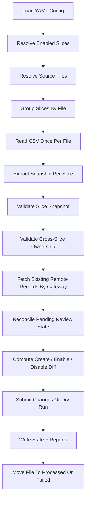

# Architecture

## Goal

Build a Python job that keeps Juspay `gatewayCardInfo` aligned with gateway BIN support for card mandates, starting with CSV sources and leaving room for future source types like gateway APIs and SI Hub APIs.

## Core Rules

- Unit of configuration: `gateway + network`
- Source data is always a full current snapshot
- Missing BINs are disabled, not deleted
- Reappearing disabled BINs are re-enabled
- Duplicate BINs inside the same slice fail validation
- One failed slice must not stop the rest
- Success currently means the change request was accepted by Dashboard, even if it remains `IN_REVIEW`

## Why This Job Is Slice-Based

Different networks under the same gateway can use different inflow types:

- `PAYU + VISA` from CSV
- `PAYU + MASTERCARD` from CSV
- `PAYU + RUPAY` from a future API

That is why the job models each `gateway + network` pair as an independent slice.

## High-Level Flow

## Components

### Config Loader

Reads YAML and validates:

- unique slice names
- supported source type
- required CSV column mappings
- runtime paths
- API endpoints and env-backed headers

### CSV Source Reader

Responsibilities:

- resolve exactly one file for a configured path or glob
- read the configured header row
- support per-source delimiter, encoding, and quotechar
- normalize gateway and network values
- extract `isin` values
- reject malformed BINs before any write

### Slice Snapshot Builder

Each slice:

- filters rows by configured `gateway`
- filters rows by configured `network`
- collects a de-duplicated set of BINs
- fails fast on duplicate BINs inside the same slice
- blocks empty snapshots by default for safety

### Cross-Slice Ownership Validation

Because the target API does not clearly expose a `network` field, the job must protect against one slice touching another slice's records.

Rule:

- the same `gateway + isin` cannot be owned by two enabled slices in the same run

If it happens, both slices fail validation and no writes happen for those slices.

### GatewayCardInfo API Client

Responsibilities:

- `list` remote records by gateway and constant card-mandate filters
- `create batch` only for genuinely new BINs
- `update disabled=true/false` per remote record id

The current write behavior is maker-checker style, so successful submission can still return `IN_REVIEW`.

### Local State Manifest

The state file protects network ownership and maker-checker retries.

It stores:

- `managed_isins`: BINs currently owned by a slice
- `pending_create`: creates submitted but not yet visible remotely
- `pending_disable`: disables submitted but not yet visible remotely
- `pending_enable`: re-enables submitted but not yet visible remotely
- `last_source_fingerprint`
- `last_run_at`

This prevents:

- duplicate create submissions while a change is still under review
- one network slice disabling BINs that another network slice owns

## Diff Rules

For each slice:

- `to_create = desired - remote_existing - pending_create`
- `to_enable = desired ∩ remote_disabled - pending_enable`
- `to_disable = previously_managed - desired - pending_disable`

`to_disable` is then intersected with active remote BINs so the job only issues valid disable calls.

## File Lifecycle

Because one CSV can feed multiple slices, file handling is coordinated at the file level.

- Parse the file once
- Process all dependent slices
- If every dependent slice succeeds, move file to `processed`
- If any dependent slice fails, move file to `failed`

## Reporting

Each run writes:

- JSON report for machine consumption
- Markdown summary for humans

Per slice, the report captures:

- source file
- matched row count
- desired BIN count
- duplicate errors
- create count
- enable count
- disable count
- unchanged count
- pending count
- failures

## Default Assumptions For V1

- `authType = THREE_DS`
- `validationType = CARD_MANDATE`
- `paymentMethodType = CARD`
- `gatewayBankCode = null`
- `juspayBankCode = null`
- source type is only `csv`

## Planned Extension Points

- gateway API source reader
- SI Hub API source reader
- richer notifications like email
- production auth strategy
- batching/rate limiting if needed later
